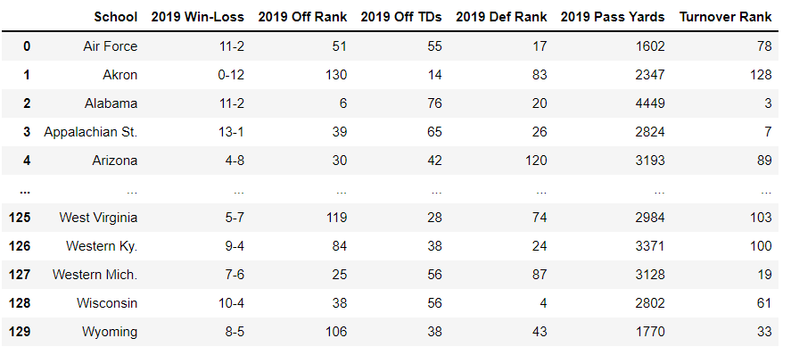
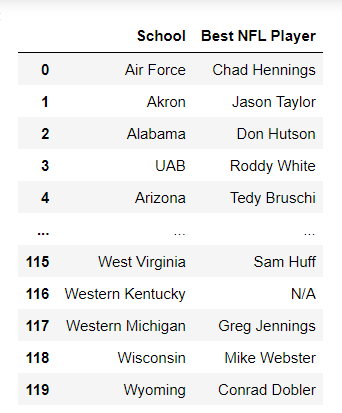
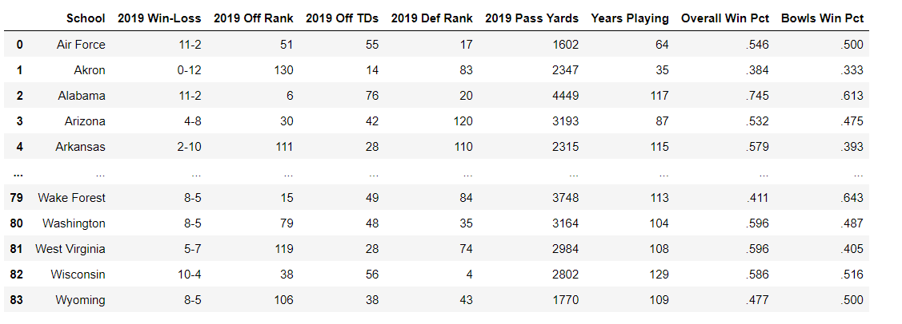

# The Best of college football using ETL
Project Description

Purpose:
To locate college football data from online sources that could be manipulated for displaying useful tables 

Extract

Kaggle was used to locate relative sources of information. We began by pulling a CSV file that had 2019 data from 50 college football teams. Afterwards, we collected data from an online listing that included historical bowl game info (www.sports_reference.com) and the best NFL players from every college (www.bleacherreport.com). Our focus was to showcase how win/loss records correlated to performance in bowl games, while also highlighting other interesting stats. Since we wanted to include data from various sources, we parsed a listing of the best NFL players from every college football team. Ultimately, we merged college football data and the NFL listing to create a table that displayed both sets of info.

Transform

Once we found our sources for data, we used Jupyter notebook to aid in our cleaning process. The CSV file that was pulled for college football data was relatively free of errors. We formatted the wins and losses column, but no other columns were altered. Afterwards, we selected the columns that we were interested in displaying and used splitting and stripping techniques to break down the data further. Aside from splitting and stripping, we also used replacement techniques to adjust any instances of ‘Nan’. Finally, we used the skills we have learned to merge our cleaned data frames together to show stats from every school, alongside the best NFL player from each school. 

Load

A relational approach was chosen for loading our database, so we agreed on PgAdmin to display our info. The data we want to present is much easier to analyze with tables and figures. We also felt more comfortable using PgAdmin due to its user-friendly layout. 

Tools Required

Pandas, Beautiful Soup, PostgreSQL, SQLalchemy.js, Census Bureau data

Instructions

• Import Dependencies • Import CSV file create dataframe • Select desired columns • Scrape sports reference website for historical table • Create historical dataframe • Clean Historic data frame • Request data from bleacher report for the best nfl player from every football team • Create BeautifulSoup object • Scrape player and school from web page • Loop through list to only get players and school • Create dataframe of best nfl player from every football team • Merge clean_CFB_2019_df and clean_historic_cfb_df • Merge school_merge_df and school_player_df • Create connection to postgesql • Find Table names in database • Load final_df to postgresql
• Load lean_CFB_2019_df to postgresql • Load clean_historic_cfb_df to postgresql • Load school_player_df to postgresql • Transform data using PostgreSQL

Files

CFB ETL Challenge Project.ipynb Jupyter Notebook with Pandas extraction code

Results

A dataframe was created using extraction techniques in Pandas that was loaded into PostgreSQL and transformed into a table of all college football teams, their 2019, record, and the best NFL player from each school.

